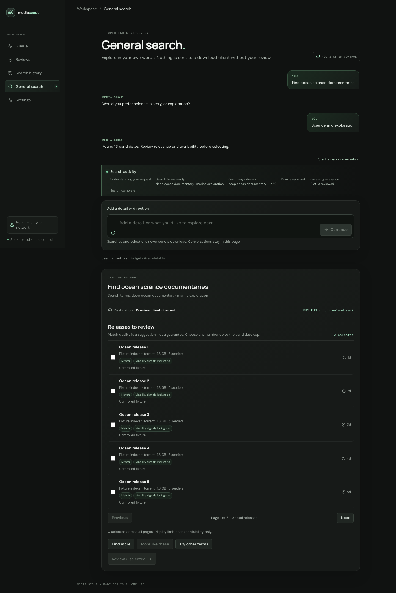
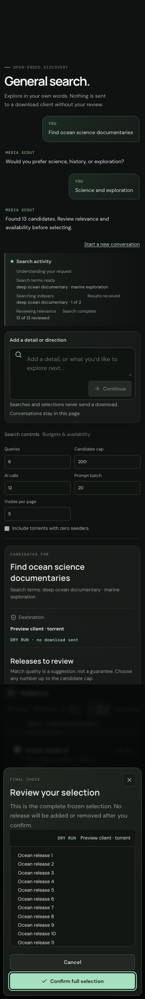
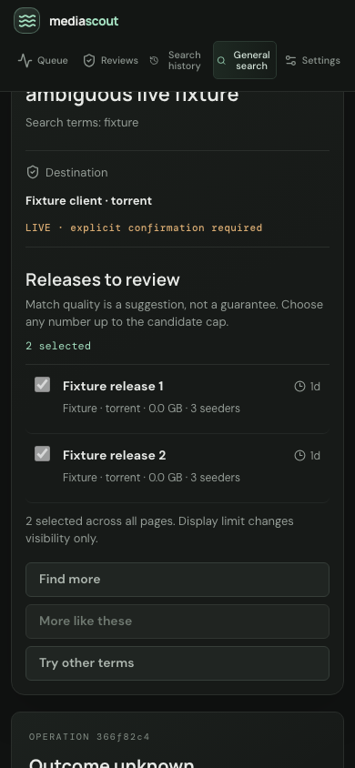

# General-search rewrite: implementation and verification record

**Status as of 2026-10-06:** Implementation and final validation gates are complete, including full backend/UI tests, typecheck, web build, desktop/mobile browser checks, controlled shared-database operation tests, and whole-system Oracle safety approval. Delivery is tracked in [draft PR #9](https://github.com/aberiggs/media-scout/pull/9). This is not a claim that live Prowlarr category routing or a real grab was validated. The handoff preserves the original requirements and labels its pre-rewrite baseline historical: [general-search-rewrite-handoff.md](general-search-rewrite-handoff.md).

## Implemented behavior

### Discovery, context, and budgets

- The additive `GeneralSearchConversationService` plans Prowlarr searches, curates actual sanitized result batches, and iteratively refines queries from those results. It returns `match`/`possible-match` candidates; `clearly-unrelated` results are omitted. There is no automatic grab in this service.
- The request preserves the original user turn and a bounded alternating conversation (original request plus at most five user follow-ups). Follow-up context is held in the web page. The service stores authenticated result snapshots and bounded query/rejection metadata, not a transcript. Snapshot IDs/tokens change as results accumulate; retained releases keep their own original expiry.
- Defaults are six queries, 200 candidates, 12 provider attempts, batch size 20, display limit 40, and hidden zero-seeder torrents. Settings ceilings are 20 queries, 1,000 candidates, 100 AI attempts, batch size 100, and display limit 1,000. Numeric per-request query/candidate/attempt/batch values can only reduce configured ceilings; display limit is a pagination preference; zero-seeder hiding can be explicitly overridden. Provider attempts include correction and transport retry sends when the LLM attempt hook is available.
- Query and release work is deduplicated across authenticated snapshots. Planner context, actual-result curation batches, and candidate output are bounded. Progress is emitted as truthful planning/query/search/result/curation events, with request-local sequence numbers starting at zero. The NDJSON route uses the same pipeline and supports cancellation; it does not promise replay/reconnect.
- Deterministic checks run before curation: credential-bearing references are rejected with the same `safeReference` predicate as the legacy general-search path; unrecognized protocols are excluded; torrent zero seeders are hidden by default; unknown counts remain distinct; stale age is a signal, not proof that a result is dead. Known incompatible protocols are excluded. If destination routing is missing or ambiguous, safe recognized-protocol discovery may remain visible but is nonselectable. A valid selectable destination must be uniquely enabled, protocol-compatible, and have a routing digest.
- Curation sees bounded sanitized public metadata and known release IDs, and returns only one of the supported classifications. Unknown, duplicate, missing, or malformed classifications fail closed. Titles and other metadata are treated as untrusted prompt data. Rejected identities are represented in snapshots only by digests.
- Existing `/api/search`, `/api/search/:id/grab`, `ma_general_search`, and `ma_general_grab` semantics remain available; new conversation and operation routes/tools are additive. No Sonarr/Radarr monitoring behavior is intentionally changed by this lane.

### Review, manifest, and operation behavior

- The web UI keeps turns in memory, consumes NDJSON progress, supports find-more/more-like-these/other-terms, and paginates without truncating the candidate manifest. Selection requires an explicit review dialog showing the complete frozen selection and destination/mode. The UI advances operations one ordinal at a time and checks read-only status after an uncertain response rather than automatically retrying a mutation.
- Operation creation validates and durably freezes the entire unique selected manifest (bounded by the effective candidate cap, up to 1,000); it does not submit. `GET /api/general-operations/:id` and MCP operation status are read-only. Explicit step calls require the expected ordinal; stop prevents future steps. SQLite stores operation status and private manifest data before mutation, and receipt reservation/step claiming is transactional. Submitted is distinct from completed/imported. Uncertain outcomes are held and are not automatically retried.
- The HTTP endpoints are unauthenticated. Compose binds the host port to loopback by default (`127.0.0.1`); use only on loopback or behind a separately trusted access boundary. Origin checks on mutations are not authentication.

## Verification evidence

| Check | Evidence/status |
|---|---|
| Full backend suite | **Passed:** `npm test`, 754 tests across 46 files on the current backend tree; includes the final NDJSON/MCP corrections and unchanged Arr regression coverage. |
| Focused discovery/operation/legacy general-search tests | **Passed:** discovery 26, durable operations 22, legacy general search 39 (87 total). |
| HTTP/MCP integration | **Passed:** 25 tests across the API integration (7) and MCP server (18), including the final stream terminal/cancellation and operation tool metadata checks. |
| Typecheck and full diff check | **Passed:** `npm run typecheck` and full `git diff --check` after final code changes. |
| Web tests/build | **Passed:** 47 UI tests and production web build after the heading-copy-only correction. No layout/style change was part of that correction. |
| Chromium browser acceptance | **Passed:** full-state Chromium checks at 1440×900 and 390×844, with overflow checked at every state and no page/console errors. The final “Outcome unknown” copy-priority correction was then retested at both sizes. See the portable screenshots below and [browser evidence JSON](evidence/general-search-browser.json). |
| Docker Compose | **Passed:** current image built and Compose became healthy; `/health` returned healthy at the loopback-published service. A deployed-UI Chromium smoke check showed the composer without page errors or overflow. |
| Whole-system Oracle review | **Approved:** discovery and durable-operation safety review, including the final MCP approval language, NDJSON terminal sequencing, and real delayed TCP disconnect cancellation test. |
| Controlled Prowlarr observation | **Read-only parser evidence only:** host and container GETs returned HTTP 200 with three enabled torrent download-client entries; the actual parser accepted all three with routing digests and no parse issues. The category arrays were empty and general client remained unset, so this does **not** validate category routing, destination selection, or grab acceptance. No live grab was performed. |

### Portable browser evidence

The full browser run covered empty, clarification, results, selection, 11-item modal, keyboard focus, expired, stopped/held, unknown/reconciled, and success states at desktop and mobile. It exercised all 11 selected IDs across pages, a frozen manifest and ordinals 0–10, and a lost step response followed by read-only GET reconciliation with zero retry POSTs. Confirmation was blocked for expired selections even when the dialog was already open. Modal focus containment, inert background, Escape focus restoration, composer keyboard submit, five-follow-up limit, and no-overflow/no-page-errors were checked.

The JSON evidence file records the desktop/mobile state and assertion matrix; only the four representative screenshots above are copied into the repository. Chromium did not provide native textarea autofill; only forced autofill pseudo-state styling/readability was checked, so native autofill is not claimed.

The “Outcome unknown” scenario is deliberately conservative: a lost mutating-step response remained held, subsequent status checks were read-only, and no automatic retry was sent. The operation tests also used two separate operation UUIDs and real service/client processes against a shared SQLite database plus a loopback fake Prowlarr HTTP counter: exactly one POST occurred and the competing operation remained held. An expired abandoned ordinal-zero restart/replay did not take over with an upstream lookup or POST. These are controlled fake-POST tests, not live download-client submissions.

## Residual limits

- Independent-process/shared-database and expired-ordinal restart evidence covers the described controlled cases; it is not a general proof against every process/network failure mode or live download-client acceptance.
- Destination routing is read and verified before an operation step, but read-versus-POST races and external routing/configuration changes cannot be made atomic with Prowlarr. Unknown, ambiguous, incompatible, or changed routing is held conservatively; uncertain submission outcomes require operator verification.
- Model classification is grounded in supplied metadata and schema-checked, but is not a proof of relevance or a complete prompt-injection defense. Human review remains required.
- The service has no authentication. Loopback/trusted-network restriction remains necessary.
- The controlled Prowlarr parser observation does not establish actual category selection/routing or successful client acceptance/import; no live grab was performed.
- Saved settings remain dry-run true, operator actions false, monitoring enabled, and general destination unset. Existing scheduled monitoring may contact the LLM/Prowlarr; manual validation used controlled fixtures and made no live grabs.

## Roadmap reconciliation

`AGENTS.md` and every item in `docs/future-features.md` were checked. No roadmap item is demonstrably completed by this rewrite: it does not add UI log visibility, favorites-informed discovery, per-search adaptive indexer selection, Jellyfin metadata tagging/management, remote MCP transport, poll timer, manual poll control, or integration-connection test UI. General conversation does not complete the broader agentic management vision. All ideas remain unchanged; no roadmap cleanup is warranted.
